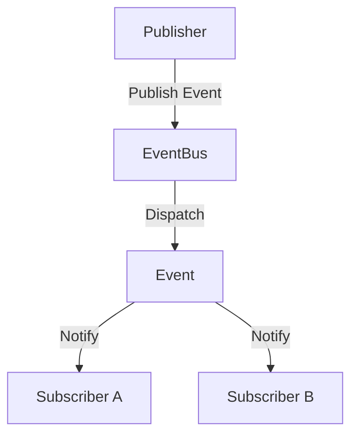
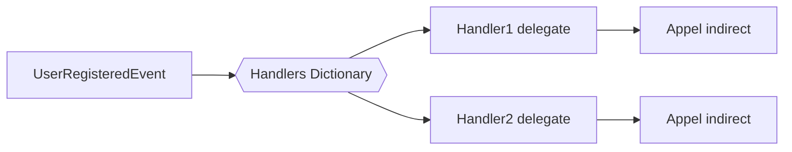

# Documentation technique – EventBus & Événements en C#/.NET

## 1. Introduction

### Définition
Un **EventBus** est un mécanisme central de diffusion d’événements permettant de **découpler** les producteurs et les consommateurs d’information. Il s'inscrit dans une architecture orientée événements (*Event-Driven Architecture*, ou EDA).

### Contexte d’utilisation
On retrouve l'EventBus dans :
- les systèmes modulaires (ex: microservices, MVVM, plugin system),
- les applications temps réel (ex: jeux, IoT),
- les frameworks de développement (ex: Prism pour WPF, MediatR).

### Objectif de cette documentation
Fournir une compréhension claire et opérationnelle de la gestion des événements dans un système .NET, incluant l’implémentation d’un EventBus simple et extensible.

---

## 2. Partie 1 – Concepts à comprendre

### 2.1 Qu’est-ce qu’un événement ?
Un **événement** représente un fait ou une action survenue dans le système. C’est un objet immuable, généralement porteur de données.

Exemple : `UserRegisteredEvent`, `OrderCompletedEvent`, etc.

### 2.2 Publisher / Subscriber
- **Publisher (émetteur)** : composant qui déclenche un événement.
- **Subscriber (consommateur)** : composant qui réagit à l’événement.

### 2.3 EventBus – Définition logique
L’**EventBus** centralise :
- l’enregistrement des abonnés,
- la distribution des événements aux bons abonnés,
- la gestion du cycle de vie des événements.

### Schéma logique (Mermaid)


---

## 3. Partie 2 – Détails techniques & mise en œuvre

### 3.1 Interface d’un événement

```csharp
public interface IEvent { }
```

Exemple d’événement :

```csharp
public record UserRegisteredEvent(string Username, DateTime RegisteredAt) : IEvent;
```

### 3.2 Gestionnaire d’événements

```csharp
public interface IEventHandler<in TEvent> where TEvent : IEvent
{
    Task HandleAsync(TEvent @event);
}
```

### 3.3 EventBus simple (in-memory)

```csharp
public class SimpleEventBus
{
    private readonly Dictionary<Type, List<Func<IEvent, Task>>> _handlers = new();

    public void Subscribe<TEvent>(Func<TEvent, Task> handler) where TEvent : IEvent
    {
        var eventType = typeof(TEvent);
        if (!_handlers.ContainsKey(eventType))
            _handlers[eventType] = new List<Func<IEvent, Task>>();

        _handlers[eventType].Add(e => handler((TEvent)e));
    }

    public async Task PublishAsync<TEvent>(TEvent @event) where TEvent : IEvent
    {
        var eventType = typeof(TEvent);
        if (_handlers.TryGetValue(eventType, out var handlers))
        {
            foreach (var handler in handlers)
                await handler(@event);
        }
    }
}
```

### 3.4 Exemple d’utilisation

```csharp
var bus = new SimpleEventBus();

bus.Subscribe<UserRegisteredEvent>(e =>
{
    Console.WriteLine($"New user: {e.Username}");
    return Task.CompletedTask;
});

await bus.PublishAsync(new UserRegisteredEvent("guilhem", DateTime.UtcNow));
```

---

## 4. Partie 3 – Analyse & Comparaison

### Avantages
- Faible couplage entre composants.
- Facilité d’ajout de comportements dynamiques.
- Extensible vers une architecture distribuée (ex: via RabbitMQ, Kafka).

### Inconvénients
- Plus difficile à tracer/déboguer.
- Risque de fuite mémoire si abonnements non nettoyés.
- Pas de garantie d’ordre d’exécution (sauf implémentation spécifique).

### Alternatives en .NET
| **Alternative** | **Description**                         | **Utilisation**               |
|------------------|------------------------------------------|-------------------------------|
| `event` natif     | Delegate avec `+=`                      | Pour des interactions directes (UI, modèles) |
| MediatR          | Médiateur d’événements via DI          | Applications DDD/CQRS         |
| Reactive (Rx)    | Programmation réactive (`IObservable`) | Données en streaming          |

---

## 5. Partie 4 – Bonnes pratiques & erreurs courantes

### Bonnes pratiques
- Garder les événements **immuables**.
- Nommer les événements au passé : `SomethingHappenedEvent`.
- Utiliser **DI** pour injecter l’EventBus.
- Nettoyer les abonnements si durée de vie limitée (éviter fuite mémoire).

### Erreurs courantes
- Publier un événement sans abonné → perte silencieuse.
- Utiliser un EventBus pour tout → confusion entre Event et Command.
- Lancer du code synchrone lourd dans le handler → blocage du bus.

---

## 6. Annexe – Approfondissements

### Contexte historique
- Les **EventBus** sont issus des architectures **pub/sub** des années 90.
- Les concepts ont été popularisés dans les frameworks UI (WPF, Java Swing) puis adaptés aux architectures backend (ex: RabbitMQ, NServiceBus).
- Aujourd’hui, c’est un **piliers des systèmes découplés** (CQRS, Event Sourcing, microservices).

### Notions connexes
- **Event Sourcing** : stockage de l’historique complet sous forme d’événements.
- **CQRS** : séparation Command (action) / Query (lecture) / Event (réaction).
- **MessageBus** vs **EventBus** : les deux transportent des messages, mais les responsabilités diffèrent.


Parfait. Voici une **section supplémentaire "Bas niveau – Ce qui se passe sous le capot"** pour les deux documentations : **EventBus/Événements** et **WebSocket**, afin de comprendre comment ces mécanismes sont gérés au niveau système ou runtime .NET.

---

## 🔧 Bas niveau – EventBus & Événements

### 1. Compilation et runtime .NET

Quand vous publiez un événement via un `EventBus`, plusieurs mécanismes sont impliqués côté runtime :
- Les **délégués** sont utilisés comme pointeurs de fonctions.
- Le bus maintient un dictionnaire en mémoire de **types** → **liste de délégués**.
- Lors de l’appel `Publish`, .NET vérifie le type de l’événement, puis **itère dynamiquement** sur les abonnés associés.
- L’appel d’un handler se fait via **appel indirect**, en passant par le delegate.

#### Illustration simplifiée


### 2. Impact mémoire et performances
- Les objets délégués (closures, lambdas) peuvent **capturer** des variables, entraînant des **allocations mémoire supplémentaires**.
- Les itérations dans un `List<Func<IEvent, Task>>` sont **synchrones ou asynchrones**, et peuvent être **parallélisées** dans des implémentations avancées (ex: via `Parallel.ForEach` ou `Task.WhenAll`).

### 3. Threading et sécurité
- Par défaut, le `SimpleEventBus` montré plus tôt n’est **pas thread-safe**.
- En cas de publication simultanée d’événements, une gestion via `ConcurrentDictionary` ou `lock` est nécessaire.

