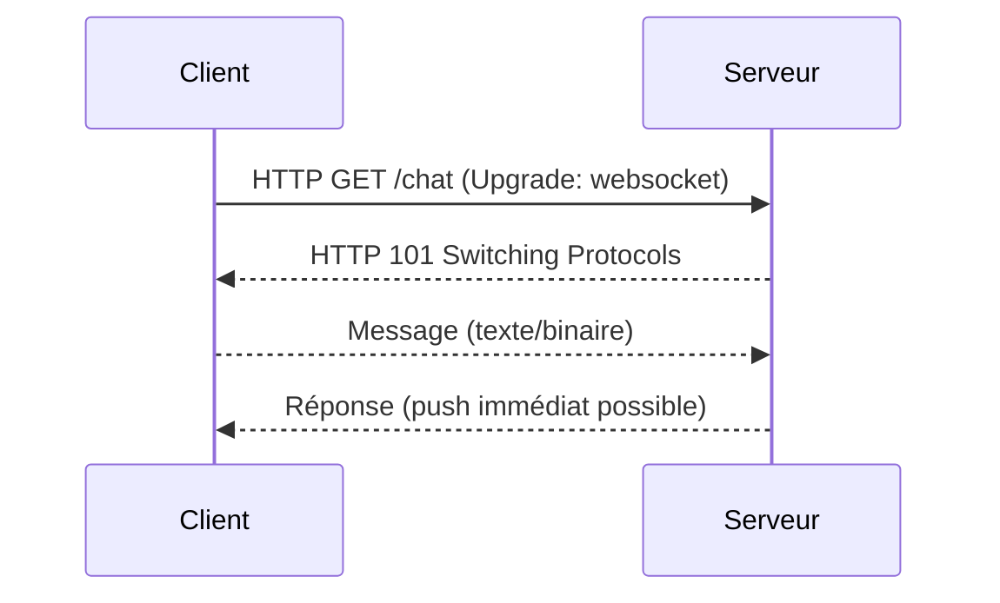
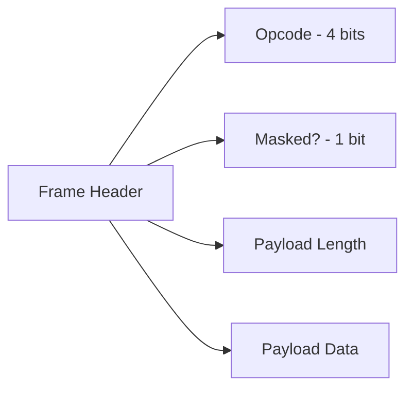

# Documentation technique – WebSocket en C#/.NET

## 1. Introduction

### Définition
Le **WebSocket** est un protocole réseau standardisé (RFC 6455) qui permet une communication **full-duplex** persistante entre client et serveur, au-dessus de TCP. Contrairement au protocole HTTP, il permet d’envoyer et recevoir des messages **sans nécessiter de requête répétée**.

### Contexte d’utilisation
Utilisé dans des contextes où une communication **temps réel** est cruciale :
- Jeux en ligne
- Applications de chat
- Dashboards avec données en direct
- Blazor Server ou SignalR dans ASP.NET Core

### Objectif de cette documentation
Comprendre le fonctionnement des WebSocket en .NET, savoir les implémenter côté client et serveur, et analyser les cas d’usage et limitations.

---

## 2. Partie 1 – Concepts à comprendre

### 2.1 Protocole WebSocket

#### Fonctionnement général
- **Négociation** via HTTP → passage en mode WebSocket (`Upgrade`)
- **Canal persistant** ouvert, bidirectionnel
- **Messages** encodés en frames (binaire ou texte)
- Basé sur **TCP** → garantit la livraison et l’ordre

### 2.2 Terminologie

| Terme         | Définition                          |
|---------------|--------------------------------------|
| Client        | L’initiateur de la connexion (navigateur, app) |
| Serveur       | L’endpoint qui accepte la connexion WebSocket |
| Frame         | Unité de message échangée            |
| Ping/Pong     | Mécanismes de keep-alive             |
| Close Frame   | Encodage de la fermeture de canal    |

### Schéma logique


---

## 3. Partie 2 – Détails techniques & mise en œuvre

### 3.1 Serveur WebSocket en ASP.NET Core

#### Middleware personnalisé

```csharp
public class WebSocketMiddleware
{
    private readonly RequestDelegate _next;

    public WebSocketMiddleware(RequestDelegate next)
    {
        _next = next;
    }

    public async Task InvokeAsync(HttpContext context)
    {
        if (context.WebSockets.IsWebSocketRequest)
        {
            using var webSocket = await context.WebSockets.AcceptWebSocketAsync();
            await EchoLoop(webSocket);
        }
        else
        {
            await _next(context);
        }
    }

    private async Task EchoLoop(WebSocket socket)
    {
        var buffer = new byte[1024 * 4];
        while (socket.State == WebSocketState.Open)
        {
            var result = await socket.ReceiveAsync(new ArraySegment<byte>(buffer), CancellationToken.None);
            if (result.MessageType == WebSocketMessageType.Text)
            {
                await socket.SendAsync(new ArraySegment<byte>(buffer, 0, result.Count),
                                       WebSocketMessageType.Text,
                                       result.EndOfMessage,
                                       CancellationToken.None);
            }
            else if (result.MessageType == WebSocketMessageType.Close)
            {
                await socket.CloseAsync(WebSocketCloseStatus.NormalClosure, "Bye", CancellationToken.None);
            }
        }
    }
}
```

#### Enregistrement dans `Startup.cs`

```csharp
app.UseWebSockets();
app.UseMiddleware<WebSocketMiddleware>();
```

### 3.2 Client WebSocket en C#

```csharp
var client = new ClientWebSocket();
await client.ConnectAsync(new Uri("wss://example.com/socket"), CancellationToken.None);

var message = Encoding.UTF8.GetBytes("Hello Server!");
await client.SendAsync(new ArraySegment<byte>(message), WebSocketMessageType.Text, true, CancellationToken.None);

var buffer = new byte[1024];
var result = await client.ReceiveAsync(new ArraySegment<byte>(buffer), CancellationToken.None);
Console.WriteLine("Received: " + Encoding.UTF8.GetString(buffer, 0, result.Count));
```

### 3.3 Utilisation avec SignalR (plus haut niveau)

```csharp
public class ChatHub : Hub
{
    public async Task SendMessage(string user, string message)
        => await Clients.All.SendAsync("ReceiveMessage", user, message);
}
```

---

## 4. Partie 3 – Analyse & Comparaison

### Comparaison WebSocket vs HTTP

| **Critère**       | **HTTP**                         | **WebSocket**                   |
|-------------------|----------------------------------|----------------------------------|
| Communication     | Unidirectionnelle (client → serveur) | Bidirectionnelle                 |
| Connexion         | Fermée après chaque requête      | Persistante                     |
| Latence           | Élevée (requête à chaque fois)   | Faible (connexion unique)       |
| Use-case typique  | API REST, site web               | Chat, dashboard temps réel      |

### WebSocket vs SignalR
| **Critère**         | **WebSocket brut**             | **SignalR**                         |
|---------------------|-------------------------------|--------------------------------------|
| Niveau d’abstraction| Bas                           | Élevé (auto-reconnexion, fallback)  |
| Protocoles supportés| WebSocket uniquement          | WebSocket, Long Polling, SSE         |
| Complexité          | Manuelle                      | Automatisée                         |

---

## 5. Partie 4 – Bonnes pratiques & erreurs courantes

### Bonnes pratiques
- Toujours vérifier `WebSocketState` avant d’envoyer.
- Implémenter une gestion du `Ping/Pong` (keep-alive).
- Prévoir un **timeout** et une **reconnexion automatique**.
- Ne pas envoyer de messages trop gros sans segmentation.

### Erreurs courantes
- Oublier la négociation `Upgrade` → 400 Bad Request
- Utiliser WebSocket sans `TLS` en production (`wss://` requis)
- Bloquer le thread principal (attendre un Receive synchronement)

---

## 6. Annexe – Approfondissements / Notions connexes

### Histoire du protocole
- **2008-2011** : Développement du standard RFC 6455
- Conçu pour combler le manque de temps réel sur HTTP
- Utilisé aujourd’hui dans **Slack**, **Trello**, **GitHub notifications**, etc.

### Protocoles associés
- **wss://** = WebSocket sécurisé (sur TLS, comme HTTPS)
- **SignalR** = abstraction .NET très populaire pour websockets
- **Socket.IO** (Node.js) = alternative côté JavaScript

---

## Fiche récapitulative

### Glossaire
- **WebSocket** : protocole de communication bidirectionnelle temps réel
- **Upgrade** : passage HTTP → WebSocket
- **SignalR** : abstraction Microsoft pour WebSocket avec fallback
- **Ping/Pong** : mécanisme de vérification de connexion
- **Full-duplex** : transmission simultanée dans les deux sens

### Check-list d’implémentation
- [x] Ajouter `app.UseWebSockets()` dans la config ASP.NET Core
- [x] Implémenter un middleware ou utiliser SignalR
- [x] Gérer `WebSocketState` et reconnexion
- [x] Protéger la communication via `wss://`

## 🔧 Bas niveau – WebSocket

### 1. Négociation HTTP → WebSocket

La connexion WebSocket commence par un **handshake HTTP** avec un en-tête spécial :
```http
GET /chat HTTP/1.1
Host: example.com
Upgrade: websocket
Connection: Upgrade
Sec-WebSocket-Key: x3JJHMbDL1EzLkh9GBhXDw==
Sec-WebSocket-Version: 13
```

Le serveur répond par :
```http
HTTP/1.1 101 Switching Protocols
Upgrade: websocket
Connection: Upgrade
Sec-WebSocket-Accept: HSmrc0sMlYUkAGmm5OPpG2HaGWk=
```

#### En interne :
- ASP.NET Core lit les headers avec le **pipeline middleware**.
- Il utilise `HttpContext.WebSockets.AcceptWebSocketAsync()` pour **interrompre le pipeline HTTP** et **passer sur le socket TCP brut**.

### 2. Communication bas niveau

Une fois établi :
- Les données sont envoyées sous forme de **frames WebSocket**.
- Chaque frame contient :
  - un opcode (texte, binaire, ping, pong, close),
  - une taille de contenu,
  - un payload (les données).
- Les frames sont **fragmentées** si trop volumineuses.

#### Schéma d’une frame WebSocket


### 3. Threads et buffers

- Le **middleware** WebSocket ASP.NET Core utilise des buffers partagés (`ArrayPool`) pour éviter des allocations coûteuses.
- Les opérations `SendAsync()` et `ReceiveAsync()` tournent sur le **ThreadPool .NET**.
- Le `WebSocket` client/serveur est implémenté via les classes :
  - `System.Net.WebSockets.WebSocket`
  - `System.Net.WebSockets.ManagedWebSocket` (implémentation de secours en userland)

### 4. Optimisations système

- Un client `WebSocket` garde **une connexion TCP ouverte**, évitant le coût du handshake HTTP pour chaque message.
- En mode sécurisé (`wss://`), la **TLS session** est maintenue pendant toute la durée de la connexion.

