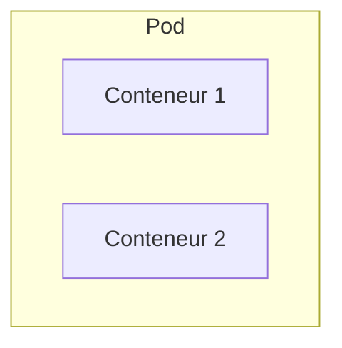
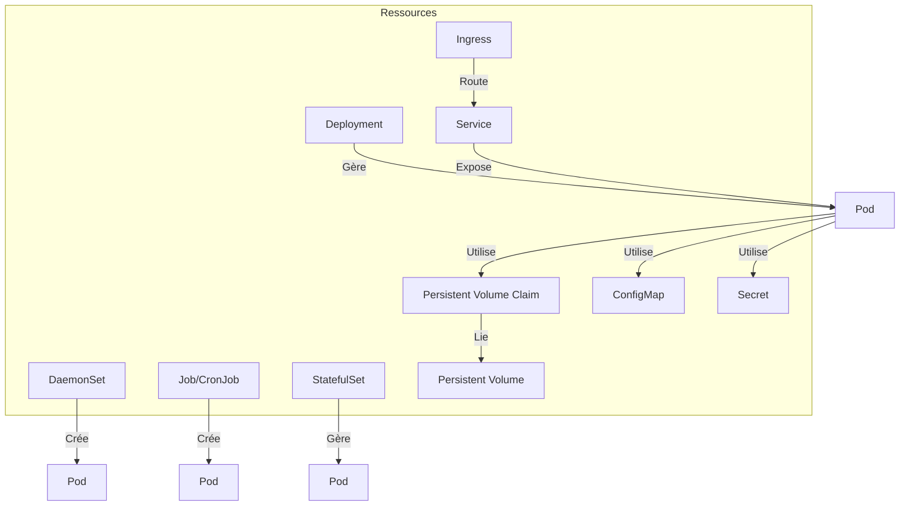
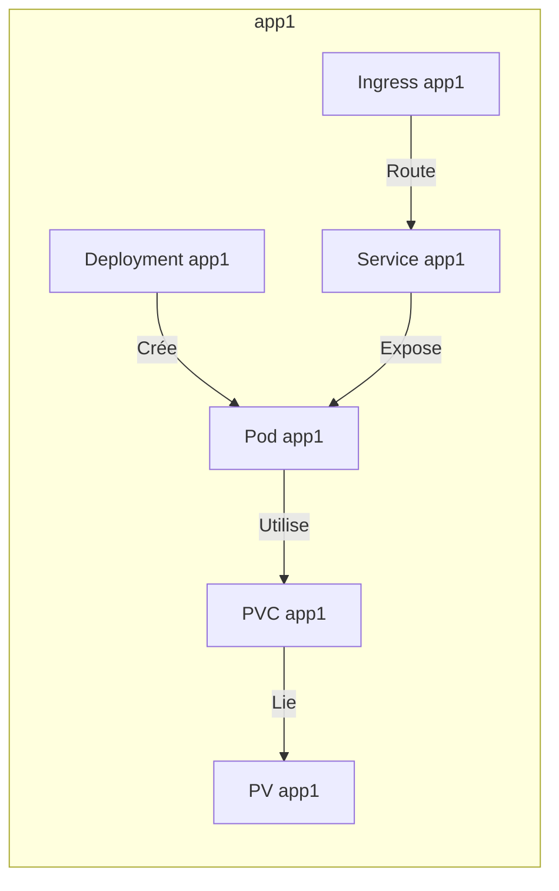
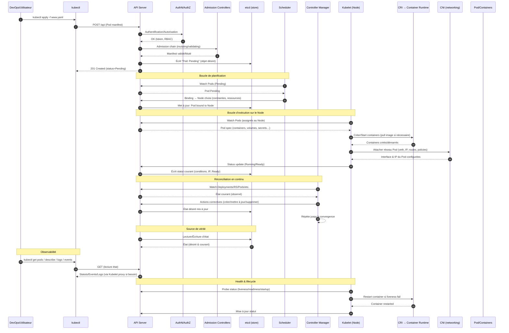
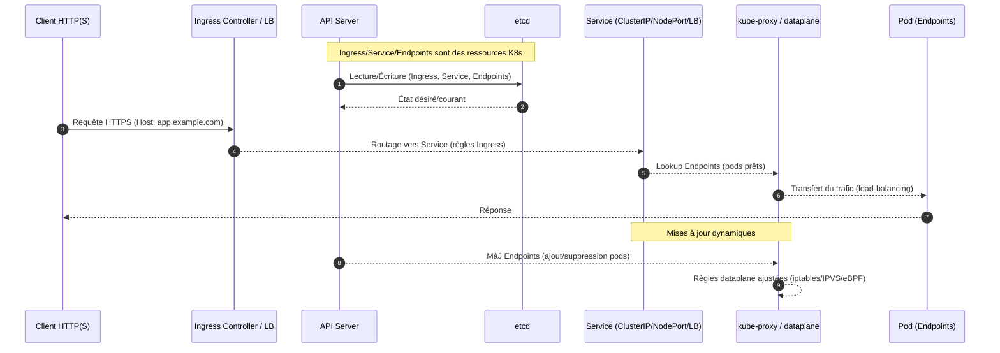

# Kubernetes

## 1. Introduction

Kubernetes est un orchestrateur de conteneurs basé sur une architecture en **clusters**.

- Un **cluster** contient plusieurs **nodes** (nœuds).  
- Les **nodes** sont des machines virtuelles (VM) ou des serveurs physiques.  
- Un node est soit un **Control Plane** (anciennement appelé *Master*), soit un **Worker**.  

### Schéma : Vue d'ensemble d'un cluster Kubernetes

```mermaid
flowchart TD
    subgraph Cluster
        direction TB
        CP[Control Plane]
        subgraph Worker1[Worker Node 1]
            P1[Pod 1]
            P2[Pod 2]
        end
        subgraph Worker2[Worker Node 2]
            P3[Pod 3]
        end
    end
    CP -- Gère --> Worker1
    CP -- Gère --> Worker2
````

---

## 2. Architecture : Control Plane, Worker et composants communs

Dans Kubernetes, certains composants tournent uniquement dans le **Control Plane**, d’autres uniquement sur les **Workers**, et certains interagissent avec les deux.

| Composant          | Control Plane | Worker Node | Rôle principal                                                        |
| ------------------ | :-----------: | :---------: | --------------------------------------------------------------------- |
| API Server         |       ✔️      |             | Point d’entrée de l’API, gestion des requêtes et de l’état du cluster |
| Controller Manager |       ✔️      |             | Supervision et actions correctives sur les ressources                 |
| Scheduler          |       ✔️      |             | Attribution des pods aux nœuds                                        |
| etcd               |       ✔️      |             | Stockage distribué de l’état du cluster                               |
| Kubelet            |               |      ✔️     | Supervision et gestion des pods sur chaque nœud                       |
| kube-proxy         |               |      ✔️     | Routage réseau et règles d’accès aux services                         |
| Container runtime  |               |      ✔️     | Exécution des conteneurs (ex : containerd, cri-o)                     |

**Pourquoi cette séparation ?**

* Les composants du **Control Plane** gèrent la cohérence, la planification et l’état global du cluster.
* Les composants des **Workers** exécutent réellement les applications (pods/containers) et assurent la connectivité réseau locale.
* Cette séparation permet la sécurité, la scalabilité et la résilience :

  * Le Control Plane peut être répliqué pour la haute disponibilité.
  * Les Workers peuvent être ajoutés ou retirés dynamiquement selon la charge.

---

### Control Plane

```mermaid
flowchart TD
    CP[Control Plane]
    API[API Server]
    CM[Controller Manager]
    SCH[Scheduler]
    ETCD[etcd]
    CP --> API
    CP --> CM
    CP --> SCH
    CP --> ETCD
```

Le Control Plane gère le cluster. Il peut être distribué sur plusieurs nœuds pour la haute disponibilité.

Composants clés :

* **API Server** : Point d’entrée HTTP/REST de Kubernetes. Toutes les commandes y transitent.
* **Controller Manager** : Supervise différents contrôleurs qui comparent l’état courant avec l’état souhaité et appliquent des corrections.
* **Scheduler** : Planifie l’exécution des pods sur les nœuds en fonction des ressources et contraintes.
* **etcd** : Base de données clé-valeur distribuée qui stocke l’état du cluster. Peut être externe au cluster.

---

### Composants présents sur chaque Worker

* **kube-proxy** : Configure les règles réseau (iptables ou IPVS) pour permettre aux services d’accéder aux pods.
* **Kubelet** : Agent du nœud, s’assure que les conteneurs sont lancés et conformes à la spécification.

  * **CRI (Container Runtime Interface)** : Communication avec le runtime de conteneur (ex : containerd, cri-o).
  * **CNI (Container Network Interface)** : Gestion du réseau des pods.
  * **CSI (Container Storage Interface)** : Gestion du stockage pour les pods.

---

## 3. Concepts essentiels

### 3.1 Les Workers

Les **Worker Nodes** fournissent les ressources nécessaires à l’exécution des pods.

---

### 3.2 Pods



* Un **Pod** est le plus petit objet exécutable dans Kubernetes.
* Il contient un ou plusieurs conteneurs qui partagent le réseau et le stockage.
* Une application tourne dans un ou plusieurs pods.

Un pod peut utiliser ou référencer :

* **ConfigMap**
* **Secret**
* **Persistent Volume Claim (PVC) / Persistent Volume (PV)**

Pour exposer un pod, on utilise un **Service**.

---

### 3.3 Ressources Kubernetes



Catégories principales de ressources :

* **Workload (exécution d’applications)**

  * *DaemonSet* : 1 pod par node (ex : monitoring).
  * *Job / CronJob* : Pods pour tâches batch ou planifiées.
  * *Deployment* : Maintient un nombre constant de pods.
  * *StatefulSet* : Gestion d’applications avec identité persistante (ex : base de données).

* **Configuration**

  * *Secret* : Données sensibles.
  * *ConfigMap* : Données de configuration.

* **Stockage**

  * *Persistent Volume (PV)* : Stockage persistant.
  * *Persistent Volume Claim (PVC)* : Requête de stockage.
  * *StorageClass* : Définit les classes de stockage disponibles.

* **Réseau**

  * *Service* : Abstraction réseau exposant les pods. Types : ClusterIP, NodePort, LoadBalancer.
  * *Ingress* : Reverse proxy géré par un Ingress Controller pour exposer des services HTTP/HTTPS.

---

### 3.4 Application dans Kubernetes



* Une application est un ensemble de ressources déployées dans un **namespace**.
* Bonne pratique : *un namespace par application*.

⚠️ Par défaut, les namespaces ne sont pas isolés fortement :

* Utiliser des **NetworkPolicies** pour cloisonner le réseau entre namespaces.

---

### 3.5 Exemple de création d’un Pod

Fichier `www.yaml` :

```yaml
apiVersion: v1
kind: Pod
metadata:
  name: www
spec:
  containers:
    - name: www
      image: nginx:1.24
```

Commande :

```bash
kubectl apply -f www.yaml
```

---

## 4. Cycle de vie d’un Pod

1. La demande est envoyée à l’**API Server** (via `kubectl`).
2. L’API Server enregistre le pod dans **etcd**.
3. Le **Scheduler** sélectionne le nœud adapté.
4. Le **Kubelet** du nœud crée le pod et demande au runtime de lancer les conteneurs.
5. Le **Controller Manager** surveille l’état et corrige si besoin (redémarrage, remplacement).

---

## 5. Focus sur certains composants

### 5.1 API Server

* API REST avec spécification OpenAPI.
* Clients : kubectl, interface web, applications internes.
* Chaque requête passe par un pipeline :

  * Authentification
  * Autorisation
  * Admission Controllers

📖 [Documentation officielle](https://kubernetes.io/docs/reference/command-line-tools-reference/kube-apiserver/)

---

### 5.2 etcd

* Le "cerveau" de Kubernetes.
* Base de données clé-valeur distribuée.
* Plusieurs réplicas communiquent via **RAFT**.
* Seul l’API Server interagit avec etcd.

🔗 [Visualisation de RAFT](http://thesecretlivesofdata.com)

---

### 5.3 Scheduler

* Lorsqu’un pod est créé, il est d’abord en état **Pending**.
* Le Scheduler choisit un nœud en fonction de :

  * `nodeSelector` / `nodeAffinity`
  * `podAffinity` / `podAntiAffinity`
  * `resources.requests`
  * `taints` / `tolerations`

Exemple : déployer un pod sur un nœud avec un label spécifique (`nodeSelector`).

---

### 5.4 Controller Manager

* Rôle : **faire converger l’état courant vers l’état souhaité**.
* L’état souhaité est enregistré dans **etcd**.
* Surveille l’état courant via l’API Server.
* Contient plusieurs contrôleurs (ReplicationController, JobController, etc.).

---

1) Création d’un Pod & boucle de réconciliation


2) Chemin réseau : Ingress/Service → Pod
