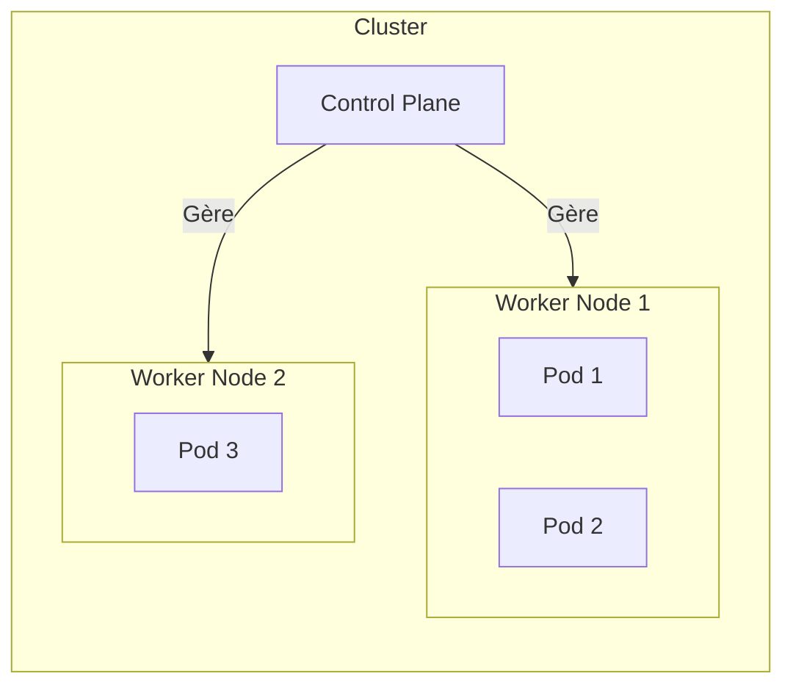
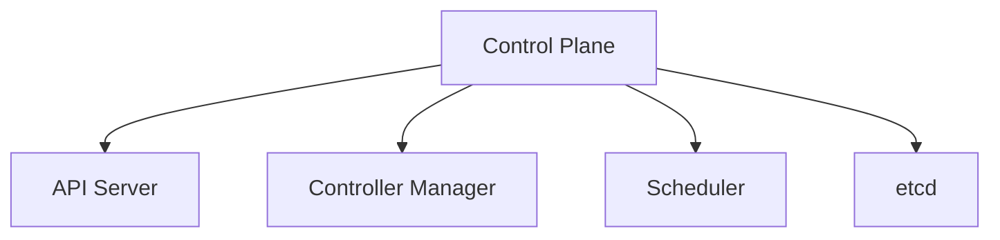
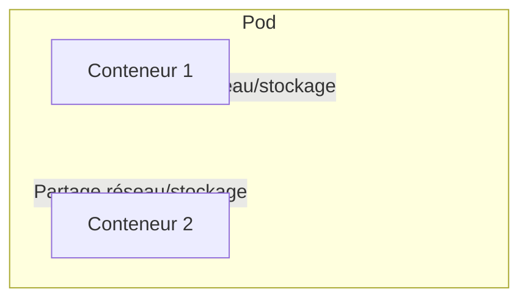
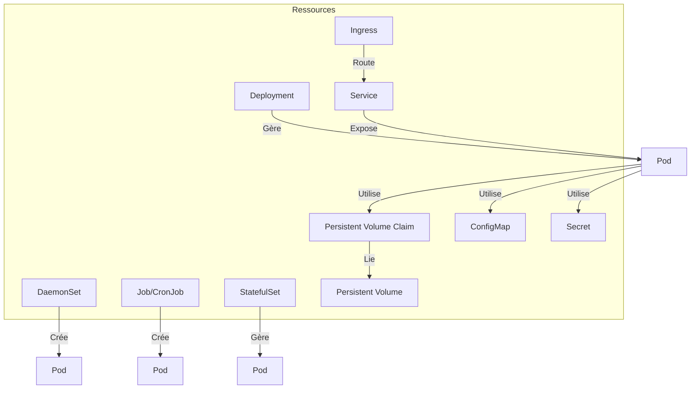
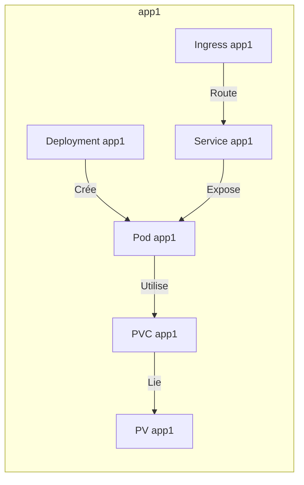

# Kubernetes

## 1. Introduction


### Schéma : Vue d'ensemble d'un cluster Kubernetes




Kubernetes est composé de clusters.

- Un `cluster` contient plusieurs `nodes` (nœuds)
- Les `nodes` sont des machines virtuelles (VM) ou des serveurs physiques
- Un node est soit un `control plane` (aussi appelé "Master"), soit un `Worker`


### Control Plane


Le control plane est en charge de la gestion du cluster. Il peut être distribué sur plusieurs nœuds pour la haute disponibilité.

Il fait tourner des composants essentiels :
- `API Server (API)` : Point d'entrée exposant l'API HTTP REST de Kubernetes. Toutes les commandes passent par ce composant.
- `Controller Manager (c-m)` : Superviseur de plusieurs contrôleurs qui surveillent l'état du cluster et effectuent des actions correctives pour atteindre l'état souhaité.
- `Scheduler (planificateur)` : Sélectionne le nœud sur lequel un pod sera lancé, en fonction des ressources disponibles et des contraintes de la spécification du pod.
- `etcd (base de données clé-valeur)` : Stocke l'ensemble de l'état du cluster de façon distribuée. Peut être hébergé à l'extérieur du cluster Kubernetes.

Autres composants importants (présents sur chaque nœud) :
- `kube-proxy` : Gère les règles réseau pour l'exposition des services. Déployé via DaemonSet, il y a un pod kube-proxy par nœud. Il configure les règles IPtables ou IPVS pour permettre la communication réseau vers les pods exposés via un service.
- `Kubelet` : Agent système (souvent géré par systemd) en charge de la gestion des pods sur chaque nœud. Il s'assure que les conteneurs d'un pod tournent conformément à la spécification et les redémarre en cas de crash. Il communique avec le container runtime (ex : containerd) via l'interface CRI.
    - `CRI` : Container Runtime Interface, permet à kubelet de communiquer avec le runtime de conteneur.
    - `CNI` : Container Network Interface, permet la gestion réseau des pods et leur communication.
    - `CSI` : Container Storage Interface, permet la gestion du stockage pour les pods.

Ces composants fonctionnent ensemble pour la gestion et l'orchestration des applications dans le cluster.


### Les Nodes Worker
Les nodes Worker mettent leurs ressources à disposition pour faire tourner des pods.


### Pods


Un Pod est un groupe de conteneurs qui partagent une pile réseau et du stockage.
- Une application va tourner dans un ou plusieurs Pods
- Un pod a un ou plusieurs conteneurs


**Un Pod peut utiliser ou référencer d'autres ressources :**
- `ConfigMap` 
- `Secret` 
- `Persistent Volume Claim (PVC)` / `Persistent Volume (PV)`

Pour accéder à un pod, il faut une ressource de type Service.


### Ressources


Une ressource est un élément de haut niveau qui permet de créer ou de gérer des pods et d'autres objets dans Kubernetes.

Les catégories de ressources :
- **Workload** : *Création de pods, lancement d'applications*
    - `DaemonSet` : Un agent déployé sur chaque node (exemple : agent de monitoring). Il y a 1 pod de DaemonSet par node.
    - `Job / CronJob` : Lance des pods pour des applications de type batch ou planifiées.
    - `Deployment` : S'assure qu'on a un nombre constant de pods en fonctionnement.
    - `StatefulSet` : Permet de mettre en place, par exemple, un cluster de base de données avec un Master et plusieurs Slaves.
- **Configuration**
    - `Secret` : Gestion des données sensibles.
    - `ConfigMap` : Gestion des données de configuration.
- **Stockage**
    - `Persistent Volume (PV)` : Volume de stockage persistant.
    - `Persistent Volume Claim (PVC)` : Requête de stockage persistant.
    - `Storage Class` : Définit les classes de stockage disponibles.
- **Réseau**
    - `Service (svc)` : Abstraction réseau permettant d'accéder aux pods. Il existe plusieurs types de services (ClusterIP, NodePort, LoadBalancer). Un service permet de faire du load balancing et d'exposer les applications.
    - `Ingress (ing)` : Utilisé pour configurer un reverse-proxy appelé Ingress Controller. L'Ingress permet d'exposer des services HTTP/HTTPS en dehors du cluster via des règles de routage.

### Une application dans kubernetes


Une application est un ensemble de ressources.


Quand on déploie une application, elle va exister dans un namespace. Un namespace est une séparation logique du cluster, permettant de découper et d'organiser les ressources.

*Bonne pratique : créer un namespace par application.*

⚠️ Attention : par défaut, il n'y a pas de cloisonnement fort entre namespaces.
- Il faudra configurer le namespace avec des ressources dédiées si l'on souhaite les isoler les uns des autres, notamment au niveau réseau (par exemple avec des NetworkPolicies).

### Créer une ressource

Pour créer une ressource (pod ou autre) :
- Il faut définir un fichier YAML décrivant la ressource.
- Utiliser le binaire `kubectl` pour l'envoyer à l'API Server.

Exemple de fichier www.yaml basique :

```yml
apiVersion: v1 # pour un pod la valeur est V1
kind: Pod # type de ressource
metadata: # définir au minimum un name
    name: www 
spec: # spec va contenir au minimum container et sa définition
    containers:
    - name: www
    image: nginx:1.24
```
commande de lancement
```bash
kubectl apply -f www.yaml
``` 


### Cycle de création d'un pod

1. La demande de création d'un pod est envoyée à l'API Server (par exemple via `kubectl`).
2. L'API Server enregistre la ressource pod dans etcd.
3. Le Scheduler sélectionne le nœud le plus approprié pour exécuter le pod, en fonction des ressources disponibles et des contraintes spécifiées.
4. Le Kubelet du nœud sélectionné reçoit l'instruction de créer le pod et demande au container runtime (ex : containerd) de lancer les conteneurs.
5. Le Controller Manager surveille l'état des ressources et déclenche des actions correctives si un pod ne tourne pas conformément à sa spécification (ex : redémarrage, remplacement, etc.).

