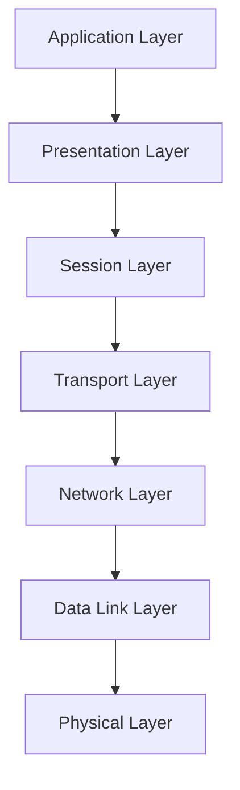

# Documentation Technique : Protocoles Réseau Modernes (2025)

## 1. Introduction

### Définition

Les **protocoles réseau** sont des ensembles de règles et de conventions qui régissent la communication entre les dispositifs d'un réseau informatique. Ils définissent comment les données sont formatées, transmises, reçues et traitées.

### Contexte d'utilisation

Les protocoles réseau sont essentiels pour assurer l'interopérabilité entre différents matériels et logiciels dans des environnements variés tels que les réseaux locaux (LAN), les réseaux étendus (WAN), l'Internet des objets (IoT), les réseaux 5G, et les infrastructures cloud.

### Objectif du document

Ce document vise à fournir une compréhension approfondie des protocoles réseau, de leur fonctionnement, de leur mise en œuvre, ainsi que des meilleures pratiques associées, en mettant l'accent sur les protocoles modernes et émergents en 2025.

---

## 2. Partie 1 – Concepts à comprendre

### 2.1 Modèles de référence

#### Modèle OSI (Open Systems Interconnection)

Le modèle OSI est une architecture en sept couches qui standardise les fonctions de communication d'un système de télécommunication ou d'un système informatique.

1. **Couche Physique** : Transmission des bits bruts sur le support physique.
2. **Couche Liaison de données** : Détection et correction des erreurs de transmission.
3. **Couche Réseau** : Acheminement des paquets de données.
4. **Couche Transport** : Transmission fiable des données.
5. **Couche Session** : Gestion des sessions de communication.
6. **Couche Présentation** : Traduction des données entre le réseau et l'application.
7. **Couche Application** : Services réseau aux applications.

#### Modèle TCP/IP

Le modèle TCP/IP, également appelé suite des protocoles Internet, est une architecture en quatre couches utilisée pour la communication sur Internet.

1. **Couche Accès Réseau** : Gestion de la transmission des données sur le support physique.
2. **Couche Internet** : Acheminement des paquets entre les réseaux.
3. **Couche Transport** : Transmission fiable des données entre les hôtes.
4. **Couche Application** : Services réseau aux applications.

### 2.2 Encapsulation et désencapsulation

Les données sont encapsulées à chaque couche du modèle, ajoutant des informations de contrôle spécifiques à chaque couche. À la réception, ces informations sont retirées (désencapsulation) pour reconstituer les données originales.

---

## 3. Partie 2 – Détails techniques et mise en œuvre

### 3.1 Protocoles par couche

#### Couche 1 – Physique

- **Wi-Fi 7 (IEEE 802.11be)** : Protocole sans fil de nouvelle génération offrant des débits jusqu'à 46 Gbps, une latence réduite et une meilleure efficacité spectrale. 

#### Couche 2 – Liaison de données

- **LoRaWAN** : Protocole pour les réseaux longue portée et basse consommation, utilisé dans l'IoT.
- **Zigbee** : Protocole sans fil basé sur IEEE 802.15.4, adapté aux applications domotiques et industrielles.

#### Couche 3 – Réseau

- **IPv6+ (SRv6)** : Extension d'IPv6 intégrant le routage par segments, améliorant la programmabilité et la flexibilité du réseau. 
- **Nym (Mixnet)** : Protocole axé sur la confidentialité, utilisant un réseau de mixage pour anonymiser le trafic. 

#### Couche 4 – Transport

- **QUIC** : Protocole de transport basé sur UDP, développé par Google, offrant des connexions plus rapides et sécurisées.
- **SCTP (Stream Control Transmission Protocol)** : Protocole orienté message, supportant la multi-homing et la multi-streaming.

#### Couche 5 – Session

- **gRPC** : Cadre RPC moderne utilisant HTTP/2, facilitant la communication entre services distribués.

#### Couche 6 – Présentation

- **TLS 1.3** : Version améliorée du protocole de sécurité TLS, offrant une latence réduite et une sécurité renforcée.

#### Couche 7 – Application

- **MQTT** : Protocole léger de messagerie publish/subscribe, adapté aux environnements contraints de l'IoT.
- **CoAP** : Protocole RESTful pour les dispositifs contraints, utilisant UDP pour une communication efficace. 
- **SFTP** : Protocole de transfert de fichiers sécurisé basé sur SSH, offrant une alternative moderne à FTP.

### 3.2 Protocoles spécifiques à l'IoT

- **NB-IoT (Narrowband IoT)** : Protocole cellulaire à faible consommation, adapté aux capteurs et dispositifs IoT.
- **Sigfox** : Réseau LPWAN propriétaire pour les communications à faible débit et longue portée.

---

## 4. Partie 3 – Analyse, comparaison, choix techniques

### 4.1 Comparaison des protocoles modernes

| Protocole       | Avantages                                                                 | Inconvénients                                                                 |
|-----------------|---------------------------------------------------------------------------|-------------------------------------------------------------------------------|
| **QUIC**        | - Connexions plus rapides grâce à l'établissement 0-RTT - Intégration de TLS 1.3 - Résilience aux pertes de paquets | - Moins mature que TCP - Support limité sur certains équipements           |
| **SCTP**        | - Multi-homing - Multi-streaming - Détection rapide des pannes       | - Complexité de mise en œuvre - Moins supporté que TCP/UDP                  |
| **gRPC**        | - Communication efficace entre services - Support de HTTP/2 - Génération automatique de code client/serveur | - Courbe d'apprentissage pour les développeurs - Moins adapté aux environnements contraints |
| **MQTT**        | - Léger et efficace pour l'IoT - Faible consommation de bande passante  | - Moins sécurisé sans TLS - Pas conçu pour le transfert de fichiers volumineux |
| **CoAP**        | - Conçu pour les dispositifs contraints - Utilise UDP pour une communication efficace | - Moins fiable que TCP - Nécessite des mécanismes supplémentaires pour la sécurité |
| **SFTP**        | - Transfert de fichiers sécurisé via SSH - Authentification forte       | - Moins rapide que certains protocoles spécialisés - Nécessite une configuration SSH |
| **Nym (Mixnet)**| - Anonymat renforcé - Résistance aux analyses de trafic                 | - Latence accrue - Complexité de mise en œuvre                              |

### 4.2 Choix techniques selon les cas d'usage

- **Applications web à haute performance** : **QUIC** est recommandé pour ses temps de connexion réduits et sa résilience.
- **Services critiques nécessitant une haute disponibilité** : **SCTP** offre des fonctionnalités avancées comme le multi-homing.
- **Microservices et architectures distribuées** : **gRPC** facilite la communication efficace entre services avec une génération automatique de code.
- **Environnements IoT contraints** : **MQTT** et **CoAP** sont adaptés pour leur légèreté et leur efficacité.
- **Transfert de fichiers sécurisé** : **SFTP** est préférable pour sa sécurité renforcée via SSH.
- **Anonymat et confidentialité** : **Nym (Mixnet)** est conçu pour des communications hautement anonymisées.

---

## 5. Partie 4 – Bonnes pratiques et erreurs courantes

### 5.1 Bonnes pratiques

- **Mise à jour régulière des protocoles** : Assurez-vous que les implémentations des protocoles sont à jour pour bénéficier des dernières améliorations de sécurité et de performance.
- **Utilisation de protocoles sécurisés** : Privilégiez les protocoles intégrant des mécanismes de sécurité, comme TLS 1.3, pour protéger les données en transit.
- **Surveillance et analyse du trafic** : Utilisez des outils de surveillance pour détecter les anomalies et optimiser les performances réseau.
- **Formation continue** : Maintenez les compétences des équipes à jour concernant les protocoles émergents et les meilleures pratiques associées.

### 5.2 Erreurs courantes

- **Négliger la compatibilité** : Implémenter des protocoles sans vérifier leur compatibilité avec l'infrastructure existante peut entraîner des dysfonctionnements.
- **Sous-estimer la complexité** : Certains protocoles, bien que performants, peuvent être complexes à configurer et à maintenir.
- **Ignorer les implications de sécurité** : Utiliser des protocoles sans mécanismes de sécurité appropriés expose le réseau à des risques.

---

## 6. Partie 5 – Aspects bas niveau

### 6.1 Fonctionnement interne des protocoles

- **Encapsulation** : Les données sont encapsulées à chaque couche du modèle OSI, ajoutant des en-têtes spécifiques pour le traitement à chaque niveau.
- **Routage** : Les protocoles comme IP déterminent le chemin que les paquets empruntent pour atteindre leur destination.
- **Contrôle de flux et d'erreurs** : Des protocoles comme TCP assurent la fiabilité de la transmission en gérant le contrôle de flux et la retransmission des paquets perdus.

### 6.2 Schéma d'encapsulation (exemple)

---

## 7. Annexe – Approfondissements / Contexte historique / Notions connexes

### 7.1 Évolution des protocoles réseau

- **Années 1970-1980** : Développement des premiers protocoles comme TCP/IP pour l'interconnexion des réseaux.
- **Années 1990-2000** : Standardisation des protocoles et adoption massive d'Internet.
- **Années 2010-2020** : Émergence de protocoles adaptés aux besoins de mobilité, de sécurité et de performance.
- **2025** : Adoption croissante de protocoles conçus pour l'IoT, les réseaux 5G, et les exigences de sécurité renforcées.

### 7.2 Normes et organisations

- **IETF (Internet Engineering Task Force)** : Développement et promotion des standards Internet.
- **IEEE (Institute of Electrical and Electronics Engineers)** : Standardisation des technologies réseau, notamment les normes Ethernet et Wi-Fi. 
